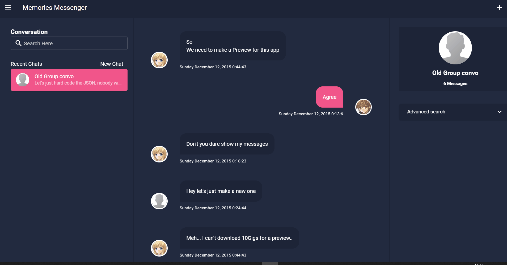

# memory-messenger

An offline messenger-like app that takes downloaded facebook data messages (or eventually any other platform), and allows to read, tag, edit and search messages by keywords, date and synonyms. Keep your old friends memories and cringes alive forever.

## Preview


Design inspired from [Ashfak Ahmed Sayem](https://dribbble.com/shots/6304417-Customer-Messaging-Web-App-Dark-Version)'s work

## TODOs

- [x] **Design** : Make a messenger like design
- [ ] **Design** : Add a light mode
- [x] **Conversations** : Load a conversation from Facebook json files
- [x] **Conversations** : Load multiple conversations and switch between them
- [X] **Conversations** : Save last open conversations on app close
- [ ] **Conversations** : Edit conversation's metadata (title and avatar)
- [ ] **Conversations** : Save and load Bookmarked messages in a conversation 
- [x] **Participants** : Show Participant Avatars from json or load a default one
- [ ] **Participants** : Set a custom avatar to loaded conversations' participants
- [x] **Search** : find messages by words and jump between results
- [x] **Search** : find messages by start date
- [X] **Photo Gallery** : Show all conversation photos in a grid list
- [X] **Photo Gallery** : Jump to message on photo click
- [ ] **Encoding** : Check and handle correct file encodings

## Project setup

Be sure to have NodeJs v8.11.2 or higher installed, get the latest version at https://nodejs.org/.
open up a terminal and type the following

```
git clone https://github.com/Sakasaky/memory-messenger.git
cd memory-messenger
npm install
```

### Compiles and hot-reloads for development

```
npm run electron:serve
```

### Compiles and minifies for production

```
npm run electron:build
```

## Tools and Languages:

- Javascript, Javascript everywhere.
- [ElectronJs](https://electronjs.org/)
- [VueJs](https://vuejs.org/) for front end.
- [vue-cli-plugin-electron-builder](https://github.com/nklayman/vue-cli-plugin-electron-builder) A Vue Cli 3/4 plugin for Electron with no required configuration that uses Electron Builder.

